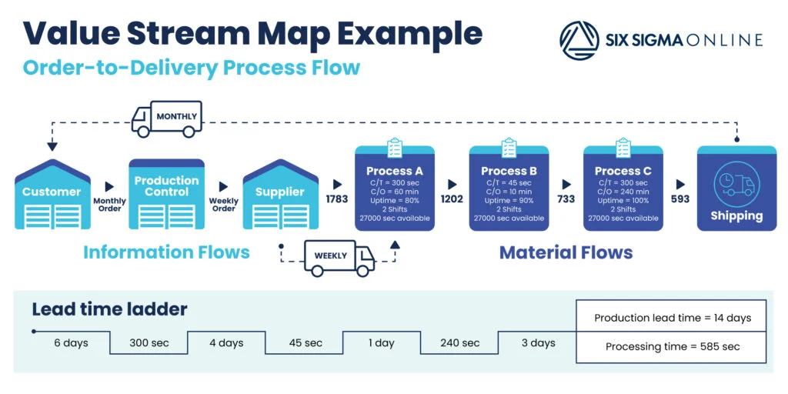
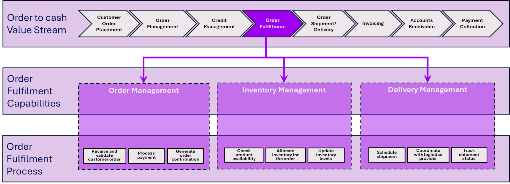

# Introduction

In today's rapidly evolving business landscape, mid-sized companies and small enterprises face increasing challenges in keeping up with digital transformation. Unlike large corporations with dedicated IT departments, these businesses often lack the resources to modernize their infrastructure, automate workflows, and optimize operations efficiently.

Many still rely on outdated methods such as manual documentation, scattered Excel sheets, and fragmented processes, which lead to inefficiencies, lost productivity, and missed opportunities. Key business functions—such as financial management, human resources, production workflows, and customer support—could benefit immensely from digital tools, yet companies hesitate due to perceived complexity, costs, or lack of technical expertise.

This is where our initiative comes in. By leveraging open-source technologies and providing an ecosystem for the rapid deployment of tailored solutions, we can help businesses adopt modern, scalable, and cost-effective IT infrastructures without the complexity of enterprise cloud platforms like AWS or Google Cloud.

Our approach ensures:

- Faster adoption of essential business tools such as ERP, HR management, and workflow automation.
- Lower costs by using open-source solutions instead of expensive proprietary software.
- Flexibility and customization, allowing businesses to modify solutions according to their needs.
- A new revenue stream for open-source contributions, driving long-term sustainability.

Through an ecosystem of pre-configured, containerized deployments, we aim to bridge the gap between modern technology and businesses that need it most—without requiring them to build expertise from scratch.

Every implementation begins with a thorough enterprise assessment and a value stream mapping (VSM) process. These initial steps allow us to understand the company's existing workflows, inefficiencies, and pain points.

## About the Service we provide

The service we envision is similar to major cloud providers like AWS or Google Cloud but much simpler and tailored for mid-sized businesses, major offices, and small enterprises. These companies often lack the resources to modernize their infrastructure and fail to recognize the benefits of cloud-based workflows. Tasks such as documentation, digital signing, centralized data storage, ERP systems, and financial management are usually handled manually, consuming unnecessary effort.

Our goal is to create an ecosystem that enables the rapid deployment of open-source solutions in Docker containers for customers. This will not only streamline business processes but also open a new revenue stream through collaboration with open-source communities.

## Service fields
Every implementation begins with a thorough enterprise assessment and a value stream mapping (VSM) process. These initial steps allow us to understand the company's existing workflows, inefficiencies, and pain points.
Enterprise Assessment

- Identify the current infrastructure and technological gaps.

- Analyze existing manual workflows and determine areas for automation.

- Assess the organization's readiness for digital transformation.

Value Stream Mapping (VSM)

- Define core business processes and how they interact with technology.

- Identify bottlenecks and inefficiencies that slow down operations.

- Develop a roadmap for implementing open-source solutions that maximize efficiency and cost-effectiveness.

This assessment provides the foundation for selecting and deploying the most relevant open-source tools, ensuring a seamless transition to modern infrastructure.

## How to execute an Assessment and VSM?
Before implementing digital transformation initiatives, it is crucial to conduct a thorough Enterprise Assessment and Value Stream Mapping (VSM). These processes help identify inefficiencies, understand existing workflows, and create a roadmap for deploying open-source solutions effectively.

This document outlines a step-by-step approach to executing these processes, ensuring that companies transition smoothly to modernized, automated workflows.

### Understanding the Organization, Enterprise Assessment
- Identify Business Goals: What are the company's key objectives, and how does technology currently support them?
- What are the bottlenecks for the management / leaders?
- What are the bottlenecks for the employees? In particular, repetitive activites, lead times, difficulties with tools, how much time they spend on certain activities
- Map Existing IT Infrastructure: Document the current software, hardware, and cloud usage.
- How the organization handling the following areas: (HR, Purchasing, Inventory, IT Assets, Marketing, Accounting)
- What kind fo data is required in the orga? How the data is stored? How they are maintaining the data?
- Assess Digital Maturity: Evaluate the company's technological adoption level (e.g., manual processes vs. partially automated vs. fully digital workflows).
- Identify Key Stakeholders: Engage with leadership and process owners to understand pain points and priorities.

### For Small businesses (1 -30 people)

The following Services 

### For Mid-Size businesses (30-100 people)

### For big enterprises (100+ people)